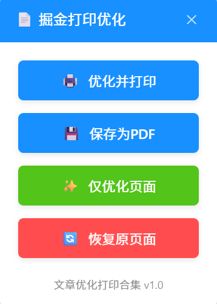

# 文章优化打印合集 📝

**优化CSDN和稀土掘金文章页面，提供清爽阅读体验，一键优化打印与PDF导出**

## ✨ 功能特点

- 🔍 **智能清理** - 移除文章页面中的广告、侧边栏、评论区等干扰元素
- 📋 **布局优化** - 自动调整页面布局，提供最佳阅读和打印体验
- 🖨️ **一键打印** - 优化后直接调用打印功能，告别手动删除无关元素
- 📥 **PDF导出** - 将优化后的文章保存为PDF，方便随时阅读和分享
- 🎨 **美观界面** - 精心设计的悬浮控制面板，操作简单直观
- 🔄 **可恢复性** - 支持一键恢复原始页面状态

## 🌟 界面展示

## 📌 支持网站

| 网站 | 支持状态 |
| --- | :---: |
| **CSDN** | ✅ |
| **稀土掘金** | ✅ |

## 🚀 安装方法

1. 首先安装 [Tampermonkey](https://www.tampermonkey.net/) 浏览器扩展
2. 点击 [这里安装脚本](https://github.com/SherryBX/ArticlePrintOptimizer/raw/main/文章优化打印合集.js)
3. 在Tampermonkey确认安装提示中点击"安装"

## 💡 使用方法

1. 安装脚本后访问 [CSDN](https://blog.csdn.net/) 或 [稀土掘金](https://juejin.cn/) 的文章页面
2. 页面右上角会出现悬浮控制面板
3. 选择需要的功能：

| 功能按钮 | 描述 |
| --- | --- |
| **🖨️ 优化并打印** | 移除干扰元素并自动调起浏览器打印窗口 |
| **💾 保存为PDF** | 优化页面并可通过打印功能保存为PDF |
| **✨ 仅优化页面** | 只移除干扰元素，不执行打印操作 |
| **🔄 恢复原页面** | 恢复到原始网页状态 |

## 📋 功能详解

### 文章优化

脚本会自动移除以下元素：
- 广告横幅和弹窗
- 侧边栏和推荐内容
- 评论区和底部推广
- 顶部导航栏（打印时）
- 其他影响阅读的干扰元素

### 打印优化

- 自动设置合适的页面边距
- 优化代码块在打印时的显示效果
- 确保图片在打印时完整显示
- 添加页码（打印时）

## 📝 更新日志

### v3.0
- ✨ 全新设计的界面风格，更加美观大方
- 🔄 统一CSDN和掘金的显示效果
- 📏 改进文本和图标对齐方式
- 🛡️ 增强样式隔离性，防止被网站样式干扰

### v2.0
- 📥 新增保存为PDF功能
- 🖥️ 改进了代码块的打印效果
- 🖼️ 修复了图片在打印时可能不显示的问题

### v1.0
- 🚀 初始版本发布

## 📄 许可证

本项目采用 [MIT](https://opensource.org/licenses/MIT) 许可证

## 👨‍💻 作者

**Sherry** | [GitHub主页](https://github.com/SherryBX)

---

<i>如果您觉得这个脚本有用，欢迎在GitHub上给它一个star ⭐</i>

 